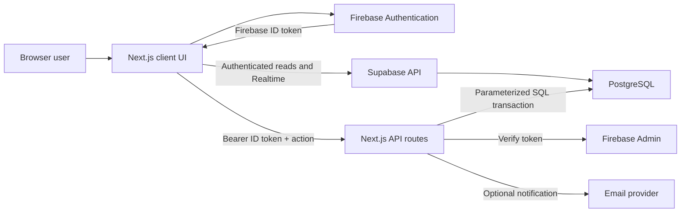

# Mahjong Club Score Tracker: Codebase Handbook

This document is the primary technical guide for developers and AI coding agents working in this repository. It describes the current production architecture, domain model, user-facing features, data flows, algorithms, design principles, operational requirements, and safe modification practices.

The application is a responsive Mahjong club score tracker. Firebase Authentication provides identity, while Supabase/PostgreSQL stores application data. The browser performs authenticated reads and selected low-risk writes through Supabase Row Level Security (RLS). Privileged or consistency-sensitive mutations run through authenticated Next.js API routes and PostgreSQL transactions.

> Privacy and security note: this handbook intentionally contains no credentials, service URLs, personal contact information, production identifiers, private club records, or historical source data. Environment variable names are documented because they are part of the application contract; their values must never be committed.

## 1. Architectural principles

The codebase is organized around the following principles:

1. **One identity provider, one application database.** Firebase is used for Google authentication and ID-token verification. Supabase/PostgreSQL is the only application-data store.
2. **Reads stay responsive.** The browser uses Supabase queries, short-lived in-memory caches, and Realtime subscriptions for data that benefits from live updates.
3. **Sensitive writes are server-authoritative.** Manager actions, game mutations, and statistics rebuilds are validated on the server after verifying a Firebase ID token.
4. **Game history is the source of truth.** Aggregate statistics and ELO events are derived from game records and can be rebuilt after a game is created, edited, deleted, or imported.
5. **Multi-document consistency is transactional.** Related PostgreSQL changes execute in a transaction. Game rebuilds also take a per-club advisory lock to prevent concurrent rebuild races.
6. **Authorization is enforced below the UI.** Buttons may be role-aware for usability, but security depends on API authorization checks and database RLS—not hidden controls.
7. **Responsive design is structural.** Mobile layouts are intentionally reorganized rather than being scaled-down desktop layouts.
8. **Accessibility and user preferences are first-class.** Controls have meaningful labels, touch targets are sized for coarse pointers, motion can be reduced, and light/dark themes share semantic color tokens.
9. **Secrets remain server-only.** Administrative credentials and database connection strings never enter client bundles, documentation, logs, screenshots, fixtures, or committed configuration.

## 2. System overview



### Runtime responsibilities

| Layer | Primary files | Responsibility |
| --- | --- | --- |
| App shell and routes | `app/layout.tsx`, `app/page.tsx`, `app/login/page.tsx`, `app/club/[clubId]/page.tsx` | Route protection, global providers, page composition, metadata, and navigation |
| Feature UI | `components/*.tsx` | Club workspace, roster, session management, leaderboard, analytics, game logs, sound, and theme controls |
| Client context | `contexts/AuthContext.tsx`, `contexts/SoundContext.tsx` | Authentication lifecycle and application-wide sound state |
| Public data boundary | `lib/data.ts` | Stable application-facing exports for data operations |
| Supabase browser adapter | `lib/supabase-data.ts`, `lib/supabase.ts` | RLS-protected reads, Realtime subscriptions, cache management, and API calls |
| Auth clients | `lib/firebase.ts`, `lib/firebase-admin.ts` | Browser Firebase Auth and server-side Firebase token verification |
| Server database access | `lib/postgres-admin.ts` | Server-only PostgreSQL pool and transaction helper |
| Privileged API | `app/api/supabase-data/route.ts` | Authenticated club, roster, season, session-support, and game actions |
| Game/stat engine | `lib/server/supabase-game-management.ts` | Game validation, transaction locking, history changes, ELO events, and full aggregate rebuilds |
| Membership automation | `lib/server/supabase-club-management.ts`, `app/api/ensure-universal-membership/route.ts` | Default/global membership enrollment and pending manager-grant application |
| Notifications | `app/api/send-join-request-email/route.ts` | Authenticated, escaped join-request email notifications |
| Domain algorithms | `lib/scoring.ts`, `lib/stats-engine.ts`, `lib/players.ts`, `lib/session-layout.ts` | Score calculation, ELO, ranking, titles, emoji allocation, and session normalization |
| Database definition | `supabase/migrations/*.sql` | Schema, constraints, indexes, views, RLS policies, Realtime publication, and historical baselines |
| Operations | `scripts/*.mjs` | Ordered schema migrations and Firebase custom-claim setup |
| Verification | `__tests__/*.test.ts` | Unit coverage for players, scoring, ELO/stat behavior, and session layout |

## 3. Technology stack

- **Framework:** Next.js App Router with TypeScript and React.
- **Styling:** Tailwind CSS utilities plus a shared token and component layer in `app/globals.css`.
- **Typography:** Manrope for interface text and JetBrains Mono for scores, ranks, labels, and other tabular data.
- **Authentication:** Firebase Authentication with Google popup sign-in; Firebase Admin verifies server requests.
- **Database:** Supabase-hosted PostgreSQL.
- **Browser data access:** `@supabase/supabase-js`, using the current Firebase ID token as the access token.
- **Server data access:** `pg` with parameterized SQL and transactions.
- **Realtime:** Supabase Realtime publications and filtered channels.
- **Charts:** Recharts for cumulative-score and ELO-rank visualizations; lightweight CSS bars for summary analytics.
- **Email:** Resend-compatible HTTP API for optional join-request notifications.
- **Audio:** Web Audio API; cues are synthesized locally and do not require audio assets.
- **Testing:** Vitest with jsdom and Testing Library dependencies.
- **Supported runtime:** Node.js 20.19 or newer.

## 4. Repository map

```text
app/
  api/
    ensure-universal-membership/   Authenticated default-membership enrollment
    send-join-request-email/       Optional manager notification
    supabase-data/                 Privileged mutation dispatcher
  club/[clubId]/                   Authenticated club workspace route
  login/                           Signed-out welcome and Google sign-in route
  globals.css                      Theme tokens, responsive rules, component styling
  icon.svg                         Browser icon
  layout.tsx                       Global header, providers, fonts, metadata
  page.tsx                         Signed-in personal dashboard
components/
  AnalyticsPanel.tsx               Summary comparison cards
  ClubWorkspace.tsx                Main club coordinator and modal owner
  DashboardContent.tsx             Detailed chart analytics and player selection
  GameLogsModal.tsx                Paginated logs, CSV, game editing/deletion
  Leaderboard.tsx                  Desktop and mobile standings
  SessionManager.tsx               Live table/session and result workflow
  SoundToggle.tsx                  Global sound control
  ThemeToggle.tsx                  Light/dark control
contexts/
  AuthContext.tsx                  Firebase auth state and sign-in actions
  SoundContext.tsx                 Sound preference and Web Audio cues
lib/
  data.ts                           Data-provider facade used by UI code
  firebase*.ts                     Firebase browser/admin configuration
  postgres-admin.ts                Server-only Postgres connection and transactions
  supabase*.ts                     Browser Supabase client and data adapter
  scoring.ts                       Fan-to-score rules and round validation
  stats-engine.ts                  Pairwise ELO and rank calculations
  players.ts                       Emoji, display colors, rank-title distribution
  session-layout.ts                New/legacy session layout normalization
  timestamp.ts                     Backend-neutral Timestamp compatibility object
  types.ts                         Shared domain interfaces
  server/                          Privileged club and game services
scripts/                            Operational scripts; never imported by browser code
supabase/migrations/                Ordered, immutable database migrations
__tests__/                          Unit tests for deterministic domain logic
```

## 5. Routes and application lifecycle

### `/login`

The signed-out landing page presents product context, Google sign-in, theme controls, and a field of independently animated Mahjong tiles. Tile motion is driven in the client, responds to pointer proximity, and respects `prefers-reduced-motion`. Google sign-in uses `signInWithPopup`, which avoids redirect-state failures in storage-partitioned mobile browsers.

Authenticated users are redirected away from the login route to the personal dashboard.

### `/`

The personal dashboard requires an authenticated user. It:

- subscribes to the user’s active club memberships;
- subscribes to player and statistics rows for each club;
- associates the signed-in Firebase UID with a linked tracked-player record;
- calculates cross-club games, wins, win rate, recent ELO movement, and club count;
- shows a per-club summary with ELO, win rate, standing, and total club-game count;
- supports creating a club, requesting to join by ID, leaving eligible clubs, opening a club, and signing out;
- displays clear loading, empty, and data-error states.

### `/club/[clubId]`

The club route normalizes the club ID, requires authentication, subscribes to the current user’s memberships, and renders `ClubWorkspace` only when the user has an active membership. Unauthorized or missing clubs receive an explanatory state rather than the workspace.

### Global layout

`app/layout.tsx` loads fonts, the favicon, theme/sound controls, `AuthProvider`, and `SoundProvider`. The brand link always points to `/`, making it the personal-dashboard shortcut for signed-in users. The header is sticky and uses semantic theme tokens.

## 6. Authentication and authorization

### Browser authentication

`AuthContext` owns Firebase auth state and exposes:

- `user` and `loading`;
- Google popup sign-in and sign-out;
- sign-in progress and user-facing error messages;
- an `isAdmin` flag derived from Firebase custom claims.

On sign-in, the context performs a best-effort call to the default-membership enrollment endpoint. A versioned local-storage key prevents unnecessary repeat calls, but enrollment remains server-authoritative. If the server adds the Supabase-compatible Firebase role claim, the client forces an ID-token refresh.

### Supabase authentication bridge

`lib/supabase.ts` creates one browser client. Its `accessToken` callback requests the current Firebase ID token. Supabase validates that JWT through the project’s configured third-party authentication integration. PostgreSQL’s `firebase_uid()` helper reads the JWT subject, allowing RLS policies to compare rows to the Firebase UID.

The Firebase token must include the role expected by Supabase. `npm run supabase:claims` is the administrative helper for assigning that claim to existing users. New/default membership enrollment can also repair the claim and request a token refresh.

### Server authentication

Privileged endpoints require `Authorization: Bearer <Firebase ID token>`. Firebase Admin verifies the token before the route uses its UID or identity attributes. Never trust a UID, role, manager flag, creator ID, or email supplied only in the JSON request body.

### Authorization layers

1. **UI affordances:** Manager-only actions are conditionally displayed.
2. **API checks:** Server routes query active membership and manager role before mutating protected resources.
3. **RLS:** Browser queries are constrained by membership-aware database policies.
4. **Constraints:** Foreign keys, unique indexes, enums, checks, and the deferred game-entry trigger protect structural integrity.

The UI layer is not a security boundary.

## 7. Data access architecture

### The `lib/data.ts` facade

UI components should import data operations from `@/lib/data`, not directly from backend-specific modules. This facade is the compatibility boundary between the UI and the current persistence implementation. It exposes:

- clubs, memberships, join requests, and managers;
- roster and player-account linking;
- seasons and configuration;
- games, history pages, analytics data, and statistics;
- live sessions and saved table arrangements;
- game mutation and aggregate rebuild actions.

This boundary makes backend behavior easier to audit and discourages database calls from spreading through components.

### Browser reads and subscriptions

`lib/supabase-data.ts` maps snake_case database rows into the camelCase domain interfaces in `lib/types.ts`. Subscription helpers generally follow this pattern:

1. execute an initial query;
2. open a filtered Supabase Realtime channel;
3. re-query after relevant changes;
4. return an unsubscribe function for React effect cleanup.

Realtime is enabled for high-value shared state such as players, memberships, statistics, sessions, and games. Do not add an unfiltered global subscription when a club- or user-filtered channel is sufficient.

### History caching and pagination

Game history uses an in-memory promise cache keyed by club and query shape. Pages default to a bounded size, with older records loaded on demand. Analytics requests reuse these loaders and request only the required range when possible. Any create, update, delete, or import operation must invalidate the affected club’s history cache so the UI cannot resurrect stale rows.

This cache is intentionally process/tab-local. It reduces repeated reads during a session but is not a replacement for database truth.

### Privileged mutations

`serverAction` in `lib/supabase-data.ts` posts an action and payload to `/api/supabase-data`. The route verifies the current Firebase ID token and dispatches to parameterized SQL inside `withTransaction`.

Actions include:

- create, soft-delete, join, leave, and manage clubs;
- approve or decline join requests;
- promote a manager now or save a pending email-based grant;
- create, deactivate, link, unlink, and update players;
- create and select seasons;
- create, update, delete, import, or rebuild games and statistics;
- save table arrangements and initialize club configuration.

Large or related write sets belong in the server transaction path, even if a similar direct browser write appears technically possible.

## 8. PostgreSQL schema

The authoritative schema is the ordered SQL in `supabase/migrations`. The following is a conceptual map, not a substitute for reading the migrations before changing a table.

| Relation | Purpose and important fields |
| --- | --- |
| `clubs` | Club identity, manager metadata, active season, active/deleted state, global/default flag, and rebuild metadata |
| `user_profiles` | Firebase UID, display metadata, and persisted sound preference |
| `club_members` | Club-to-Firebase-user membership, role, active state, and join metadata |
| `join_requests` | Pending/approved/declined membership requests and resolution audit fields |
| `players` | Club-scoped tracked player, display name, emoji, optional Firebase UID link, and soft-active state |
| `seasons` | Club-scoped numbered seasons and active state |
| `app_configs` | Club-scoped ELO tuning and legacy title-band configuration |
| `games` | Game metadata: time, season, table, result type, winner/loser, fan, notes, creator, and historical flag |
| `game_entries` | One score per game/player; cascade-deleted with the game |
| `player_stats` | Rebuilt all-time aggregates and ranks |
| `season_player_stats` | Rebuilt aggregates and ranks scoped to a season |
| `elo_events` | Per-game/per-player ELO before/after values and pairwise calculation detail |
| `sessions` | One active session per club, participants, table count, table JSON, sideline, and close time |
| `table_arrangements` | Timestamped table/sideline snapshots |
| `pending_manager_grants` | Email-normalized manager grants applied when a matching account exists or signs in |
| `stat_baselines` | Aggregate starting points for migrated historical data |
| `games_with_entries` | RLS-aware view joining game metadata and score entries |
| `user_clubs` | RLS-aware view joining memberships to basic club metadata |

### Key database invariants

- Club roles and request states are PostgreSQL enums.
- Active player emojis are unique within a club when an icon key is present.
- A club may have only one active session.
- A game entry set contains no more than four players.
- A completed four-player game must sum to zero; the deferred trigger validates the final transaction state rather than every intermediate insert.
- Game-to-player and season-to-club relationships are enforced with foreign keys.
- History and ranking access patterns have club-, season-, date-, user-, and player-oriented indexes.

### Row Level Security

RLS is enabled on application tables. Policies broadly allow:

- users to manage their own profile;
- users to see their own memberships and members of clubs they belong to;
- club members to read players, seasons, config, games, entries, statistics, ELO events, sessions, arrangements, and baselines for their clubs;
- managers to manage seasons/config and review protected manager data;
- members to write collaborative session and table-arrangement state;
- authenticated users to create a join request for themselves.

Privileged server SQL still performs explicit authorization checks. A direct database connection bypasses browser RLS, so server code must never assume RLS has protected it.

## 9. Domain model

Shared client-facing types live in `lib/types.ts`:

- `ClubDoc` and `ClubMembershipDoc` describe club identity and the user’s role.
- `JoinRequestDoc` describes the membership approval workflow.
- `PlayerDoc` represents a tracked player independently of an authenticated user.
- `GameDoc` and `GameEntryDoc` capture a result and its zero-sum scores.
- `EloEventDoc` records rating calculation details for a player in one game.
- `PlayerStatsDoc` is the derived all-time or season aggregate.
- `SessionDoc` describes the active table-management state.
- `TableArrangementDoc` is a saved seating snapshot.
- `SeasonDoc` and `AppConfigDoc` provide season and ELO configuration.

### Backend-neutral timestamps

`lib/timestamp.ts` implements the small timestamp surface used by the UI (`now`, `fromDate`, `toDate`, `toMillis`, and second/nanosecond fields). This preserves stable domain types without importing a database-specific timestamp object. New UI/domain code should use this wrapper rather than reintroducing Firestore types.

## 10. Feature catalog

### Personal dashboard

- Time-aware signed-in greeting.
- Animated count-up summary for games, win rate, recent ELO, and memberships.
- Compact recent-rating sparkline.
- Club cards that identify the linked player and show personal stats.
- Club game counts without downloading the game collection.
- First-club empty state.
- Create club, request to join by ID, open club, leave eligible club, and sign out.

### Clubs and membership

- Create a club with a generated, human-shareable ID.
- Request membership using a club ID.
- Optional manager email notification with an authenticated review link.
- Manager approval or rejection of pending requests. The selected request is removed optimistically, restored if the mutation fails, and accompanied by a short accessible success/error notice.
- Leave an eligible non-manager membership.
- Default/global membership enrollment during authentication.
- Manager promotion by email:
  - existing Firebase users are promoted immediately;
  - unknown emails create a pending grant;
  - pending grants are applied after a matching user signs in.
- Manager-only soft deletion with exact club-name confirmation.

### Roster and player identity

- Tracked players exist separately from authenticated accounts, allowing historical and guest play.
- Managers can add, rename, and deactivate players. Roster deletion controls are never rendered for regular members, and the API repeats the manager check before mutating data.
- Managers can update a player emoji by selecting the player icon. The curated picker prevents duplicate active icons, while its custom input (opened directly by right-click on desktop) accepts an emoji outside the automatic default list.
- New/imported players receive a random emoji from a curated set when one is not supplied.
- Active emojis are kept unique per club where possible.
- A signed-in member can link their account to one unlinked tracked player in a club and can unlink their own account.
- Once a user is linked, other unlinked profiles no longer show a link action until that user unlinks their current profile.
- The UI keeps player names visible, uses a compact manager-only remove control, and contains the emoji picker within a four-column responsive menu.
- Managers can review club members and promote additional managers from the roster modal.

### Seasons

- Each club begins with a first season.
- Managers can create the next numbered season and switch the active season. Selecting an existing season updates local club/season state immediately after the API confirms, causing the leaderboard, session, analytics, and logs to resubscribe without a manual browser refresh. Creating a season transactionally closes the previous live session and refreshes the workspace so every season-scoped subscription restarts cleanly.
- Leaderboard, session, analytics, and logs can be season-scoped.
- All-time and season statistics are stored separately but rebuilt from the same authoritative history.

### Session manager

- Create or resume one active session per club. Session creation is transactional: a stale active session from an older season is closed before the new session is inserted, preventing the partial unique-index conflict on active sessions.
- Choose participating players and a table count.
- “All” selection includes the complete currently filtered roster selection.
- New sessions begin with every participant on the sideline and empty numbered tables.
- Mobile-only decrement/increment controls make table count editing reliable without text-selection quirks.
- Move players between sideline and tables, fill open seats, clear tables, swap players, and edit the session. The add-player dialog shows the table's selected players first and lets the user remove a selection without closing the dialog.
- Search by player or table.
- Table cards show capacity and readiness; four players marks a table ready.
- Record self-draw wins, discard wins, or draws.
- Winner, discarder, and fan selections have visible selected states.
- Calculated scores are previewed and must sum to zero before saving.
- Saved wins trigger a cheerful, viewport-centered announcement with winner identity and score changes.
- Session dialogs are rendered through a document-body portal, centered in the viewport regardless of page scroll, and use a full-viewport opaque fade. The help dialog has an independently scrollable body and explains both sessions and seasons.
- Session state is persisted collaboratively through Supabase and restored on another device.
- Legacy malformed table keys are normalized safely; participants are recovered to the sideline rather than lost.

### Scoring and game recording

The fan lookup in `lib/scoring.ts` maps fan values to base points. For normal results:

- **Self draw:** the winner receives three times the base value; each other player loses one base value.
- **Discard win:** the winner receives twice the base value; the discarder loses twice the base value; uninvolved players receive zero.
- **Draw:** all players receive zero.

Every stored game must contain two to four distinct players, finite numeric scores, and a zero total. Four-player zero-sum integrity is also enforced by PostgreSQL.

### Game logs

- Loads a bounded recent page instead of the full club history.
- Loads older pages on demand.
- Filters by season, active-session participants, or a specific player.
- Loaded records are always displayed newest first; loading an older page preserves that descending chronology.
- Mobile condenses season and player filters into a collapsed disclosure with an active-filter summary, keeping records near the top of the viewport; desktop keeps the controls expanded.
- Desktop uses a horizontally scrollable score table with sticky date and header cells.
- Mobile uses readable game cards rather than compressing the wide table.
- Rows/cards expose hover, focus, title, and “Review” cues when editable.
- Selecting a game opens a viewport-centered record editor.
- Managers can change date/time, season, scores, and notes or delete the record.
- Update/delete closes the editor after success, invalidates history cache, refreshes the page, and rebuilds dependent statistics.
- CSV export includes metadata and a player score column for each included player.
- CSV import supports quoted fields, multiple date formats, score normalization, new player creation, randomized emoji assignment, and player columns even when those players have no scored rows.
- Imported game batches use the same server validation and rebuild path as regular games.

### Leaderboard

- The leaderboard sorts primarily by derived points rank with stable fallbacks.
- Desktop columns show rank, player, points, ELO value, games, wins, losses, and win ratio.
- ELO rank is intentionally not displayed beside the ELO value.
- The player subtitle contains only the derived rank title—no duplicate ELO or “last five” metric.
- Mobile shows a focused rank/player/points/ELO table, initially limited to the top five with an explicit expansion control.
- Desktop preserves the full final column with a deliberate minimum width and horizontal scrolling.

#### Rank-title distribution

Titles are recalculated from the player’s position in current points standings; they are not stored as a permanent achievement. `lib/players.ts` distributes nine ordered titles across a symmetric set of bands using proportions:

```text
4% / 7% / 12% / 17% / 20% / 17% / 12% / 7% / 4%
```

Rounding drift is assigned to the central band. Small clubs may have empty bands. Stable leaderboard sorting prevents arbitrary title movement when primary ranking values tie. The legacy `players.title` field is not the authoritative displayed rank title.

### Analytics

- Defaults the player selection to active-session participants when available.
- Supports clearing the selection and multi-selecting specific players, which keeps large rosters usable.
- Supports recent-history ranges and all-history mode.
- Cumulative score chart uses short-form dates on the x-axis.
- ELO rank bump chart derives valid ranks over time and avoids rendering invalid/`NaN` values.
- Summary cards show rank alignment, ELO headroom, points per game, and recent ELO movement.
- Empty and loading states explain when more games or player selection are needed.

### Themes, motion, and sound

- Light/dark mode follows saved preference or initial OS preference.
- Sound can be enabled or muted globally; preference is cached locally and stored in the user profile.
- Web Audio cues cover tiles, wins, losses, draws, achievements, confirmations, rank changes, and errors.
- Audio context is unlocked only after user interaction to comply with browser autoplay policies.
- Repeated cues are throttled to prevent harsh overlap.
- The login tile field moves continuously in normal motion mode and reacts to pointer/touch proximity.
- Count-up, chart, entrance, celebration, and background animations respect reduced-motion preference.

## 11. Statistics and ELO engine

### ELO calculation

`calculateRoundEloDeltas` treats each game as all pairwise comparisons among its participants:

1. Calculate the standard expected score from the two current ratings.
2. Assign actual score `1`, `0`, or `0.5` from the players’ game scores.
3. Calculate a logarithmic margin multiplier from the absolute score spread.
4. Choose each player’s K factor from configured new, intermediate, or veteran thresholds.
5. Average the pair’s K factors and accumulate pair deltas for each player.
6. Round the final per-player delta and rating.

The event stores rating before/after, delta, K factor, average margin multiplier, and opponent-level details. ELO-game count is tracked separately from displayed games-played so imported baselines can behave correctly.

### Rebuilt aggregates

The rebuild engine produces all-time and season rows containing:

- total points;
- games played, won, and lost;
- win/loss ratio;
- best and worst single-game result;
- current and peak ELO;
- ELO and points ranks;
- latest-five ELO deltas and their sum;
- attendance days and last-played date;
- optional playoff seed data.

Rank ties use competition ranking: equal values receive the same rank and the following rank skips the tied positions.

### Mutation/rebuild transaction

Game creation, editing, deletion, import, and manual rebuild run through `mutateSupabaseGames`:

1. Normalize the club identifier.
2. Begin a transaction and take a club-scoped PostgreSQL advisory lock.
3. Verify active membership; editing/deleting/importing/rebuilding requires manager role.
4. Validate and mutate the authoritative game and entries.
5. Read aggregate baselines.
6. Replay current game history in chronological, stable order.
7. Replace current ELO events and all-time/season aggregate rows.
8. Commit atomically, or roll back the entire operation on error.

This design favors correctness and repairability. Do not update one aggregate field directly in response to a game edit.

### Historical baselines

Migrated history may be represented as normal `games`/`game_entries` rows marked `is_historical`, with authoritative starting aggregates in `stat_baselines`. A rebuild starts from those baselines and replays only non-historical games. Editing or deleting historical records adjusts the affected baseline before replay.

A designated legacy season also supports a compatibility rule in which points cover the complete source history while participation-related metrics begin at a configured schema cutoff. This is intentionally isolated migration behavior. New seasons follow normal application tracking for every metric. Do not copy this exception to new clubs or seasons.

The exact production club identifier, source records, and cutoff are operational data and are deliberately not documented here.

## 12. Session layout invariants

Current sessions use stringified numeric table keys (`"1"`, `"2"`, and so on). `createInitialSessionLayout` creates every requested table empty and places every participant on the sideline.

`normalizeSessionLayout` guarantees that:

- only current numeric table keys are used;
- a participant appears at most once in the normalized result;
- participants missing from stored tables are recovered to the sideline;
- old `table_1`-style auto-seated records are treated as legacy malformed state and recovered without silently dropping people;
- a valid modern seating assignment remains intact.

Do not reintroduce `table_N` keys into persisted active sessions. If the shape changes again, add a normalization path and regression tests.

## 13. UI and design system

### Visual direction

The interface should feel professional, precise, warm, and connected to Mahjong without becoming ornamental. The design uses restrained references—tile proportions, cinnabar accents, bamboo green, warm paper surfaces, monospaced score typography—while keeping data dominant.

### Semantic tokens

`app/globals.css` defines light and dark RGB tokens for:

- `--ink` and `--muted` text;
- `--canvas-top`, `--canvas-bottom`, and `--surface-highlight` atmosphere;
- layered surface values and `--line` borders;
- `--bamboo`, `--bamboo-bright`, `--cinnabar`, and `--gold` accents;
- shadows, radii, and subtle grain.

New styling should use these semantic variables instead of one-off theme colors. Dark mode overrides the token values and includes compatibility rules for existing Tailwind text/background classes.

### Background and surface hierarchy

The page background uses asymmetric radial and directional gradients plus near-invisible grain. It must read as atmosphere, not decoration. Avoid generic repeating geometric patterns, uniform high-opacity texture, or flat single-color canvases.

Content sits on distinct surface layers with borders, restrained offset shadows, and dark-mode highlights. Cards and modals must remain visually separate from the canvas in both themes.

### Typography

- Manrope is the primary readable interface font.
- JetBrains Mono is reserved for numeric data, compact labels, table metadata, and rank/score emphasis.
- Avoid novelty/display fonts for long text or dense controls.
- Data columns should use stable widths and tabular visual rhythm.

### Responsive behavior

- The global content width is capped for readable desktop composition.
- The club workspace uses a desktop two-column layout, but mobile places the session above standings and uses a sticky three-option workspace navigator.
- The desktop action bar collapses into a simple mobile grid.
- Full-screen mobile modal panels use `100dvh` and safe-area padding.
- Session-specific dialogs use fixed viewport positioning, never document-relative centering.
- Wide data tables scroll horizontally on desktop/tablet; game logs become cards on mobile.
- Controls used on touch devices should have at least a 44-pixel interactive dimension.
- Hover-only actions must also be visible or reachable on coarse-pointer devices.

### Interaction and accessibility

- Use semantic buttons, labels, headings, tables, and navigation landmarks.
- Icon-only buttons require `aria-label` and usually a visible tooltip/title.
- Focus states must remain visible in both themes.
- Selection must be expressed by more than a faint background change.
- Destructive actions require explicit confirmation; club deletion requires exact-name input.
- Dialogs need clear close/cancel paths, bounded viewport height, and scroll containment.
- Loading and error states should describe what happened without exposing internal errors or secrets.
- Respect `prefers-reduced-motion`; motion must enhance comprehension, not gate functionality.

## 14. API contracts

### `POST /api/supabase-data`

Headers:

```text
Authorization: Bearer <Firebase ID token>
Content-Type: application/json
```

Body contains an `action` plus action-specific data. Successful responses use `{ "result": ... }`; failures use `{ "error": "safe message" }` with an appropriate status. The route is Node-only and may run longer for a full history rebuild.

Do not make this a generic SQL endpoint. Every new action must:

- validate its payload;
- derive caller identity from the verified token;
- perform an explicit membership/role check;
- use parameterized SQL;
- keep related writes in one transaction;
- return only data the caller needs.

### `POST /api/ensure-universal-membership`

Verifies the Firebase token, ensures the default/global membership and profile state, applies eligible pending manager grants, and reports whether the client must refresh its token. The endpoint is intended to be idempotent.

### `POST /api/send-join-request-email`

Verifies the requester, confirms the pending request from PostgreSQL, escapes user-controlled HTML, builds a review URL from configured application origin, and sends an optional manager notification. Missing email configuration returns a service-unavailable response without blocking the database join request itself.

## 15. Environment configuration

Copy `.env.example` to `.env.local` for local development. The repository must contain names and documentation only—never real values.

| Variable | Exposure | Purpose |
| --- | --- | --- |
| `NEXT_PUBLIC_FIREBASE_API_KEY` | Browser-visible | Firebase web application configuration |
| `NEXT_PUBLIC_FIREBASE_AUTH_DOMAIN` | Browser-visible | Firebase Auth domain |
| `NEXT_PUBLIC_FIREBASE_PROJECT_ID` | Browser-visible | Firebase project identifier |
| `NEXT_PUBLIC_FIREBASE_STORAGE_BUCKET` | Browser-visible | Firebase web configuration compatibility |
| `NEXT_PUBLIC_FIREBASE_MESSAGING_SENDER_ID` | Browser-visible | Firebase web application configuration |
| `NEXT_PUBLIC_FIREBASE_APP_ID` | Browser-visible | Firebase web application identifier |
| `NEXT_PUBLIC_APP_URL` | Browser-visible | Canonical deployed origin for links and email fallbacks |
| `FIREBASE_SERVICE_ACCOUNT_JSON` | **Server-only secret** | Firebase Admin token verification and user/claim administration |
| `NEXT_PUBLIC_SUPABASE_URL` | Browser-visible | Supabase project API URL; must be a complete HTTP(S) URL |
| `NEXT_PUBLIC_SUPABASE_PUBLISHABLE_KEY` | Browser-visible | Publishable key used with RLS and Firebase JWT access token |
| `SUPABASE_DATABASE_URL` | **Server-only secret** | Direct/pooler PostgreSQL connection for API transactions and migrations |
| `RESEND_API_KEY` | **Server-only secret** | Optional join-request email provider credential |
| `EMAIL_FROM` | Server-only configuration | Verified sender address for notifications |

`NEXT_PUBLIC_*` values are included in the client bundle and must never contain administrative secrets. The database URL and Firebase service account must exist only in secure local/deployment secret storage.

The application does not require a Supabase service-role key for its current architecture.

## 16. Local development

Prerequisites:

- Node.js 20.19+;
- npm;
- a Firebase project with Google sign-in enabled;
- a Supabase project configured to accept Firebase JWTs;
- a PostgreSQL connection string authorized to apply migrations;
- the required local environment variables.

Typical workflow:

```bash
npm install
npm run supabase:schema
npm run dev
```

Useful commands:

```bash
npm run lint
npm test -- --run
npm run build
npm run supabase:schema
npm run supabase:claims
```

The development build uses `.next-dev`; production builds use `.next`. This separation prevents local development artifacts from conflicting with production build output.

## 17. Database migrations

1. Add a new ordered SQL file under `supabase/migrations`.
2. Make the migration safe for the current production schema. Prefer explicit, narrowly scoped changes.
3. Do not edit an already-applied migration to represent a new change; add the next migration.
4. Run `npm run supabase:schema` with a server-only database URL.
5. Verify RLS, indexes, constraints, and Realtime publication when adding a table.
6. Update `lib/types.ts`, row mappers, server SQL, tests, and this document as appropriate.

The migration runner:

- creates `public.app_schema_migrations` if required;
- applies files in filename order;
- records each applied filename;
- skips previously recorded files;
- fails rather than silently continuing after an SQL error.

Run migrations from a trusted administrative environment. Never expose the database connection string to browser code.

## 18. Deployment

The code is designed for a Node-capable Next.js host. Before deployment:

1. Configure every environment variable for the intended environment; preview and production values are separate.
2. Ensure the Supabase URL is a valid complete URL, not a project name or dashboard URL.
3. Add the deployed hostname to Firebase Auth authorized domains.
4. Configure Supabase’s Firebase third-party auth integration and required JWT role claim.
5. Apply all database migrations.
6. Configure the optional email sender only if notifications are desired.
7. Run lint, tests, and a production build.

`next.config.mjs` uses trailing slashes, unoptimized images, and a `Cross-Origin-Opener-Policy: same-origin-allow-popups` header to support popup authentication. `firebase.json` remains a legacy/static hosting configuration and is not evidence that Firestore is in use.

## 19. Testing and quality gates

Current deterministic unit suites cover:

- emoji allocation and rank-title banding;
- score construction and zero-sum validation;
- pairwise ELO, K-factor behavior, titles, and ranking;
- initial session layout and legacy session normalization.

Before handing off a code change, run checks in proportion to the risk:

```bash
npm run lint
npm test -- --run
npm run build
```

Additional manual checks are required for interaction-heavy changes:

- Google sign-in on desktop and mobile Safari;
- light and dark themes;
- small mobile viewport and desktop viewport;
- keyboard focus and modal close paths;
- session updates in two browser windows;
- game create/edit/delete followed by leaderboard and analytics refresh;
- CSV import/export with quoted names, blank player columns, and mixed dates;
- reduced-motion preference;
- sound preference and first-interaction audio unlock.

Tests must use fabricated data. Never copy production names, emails, identifiers, game history, or credentials into fixtures or snapshots.

## 20. Error handling and observability

- Client components show safe, actionable messages and retain retry paths.
- API routes catch failures and return sanitized messages. Internal errors may be logged server-side, but credentials, ID tokens, database URLs, service-account JSON, and complete personal records must never be logged.
- Realtime subscription errors should invoke an error callback where the screen has a recoverable error state.
- Failed game transactions roll back all writes; the UI must not optimistically claim success before the response.
- Email failure is independent of the persisted join request.
- Browser storage access is best-effort because privacy modes may block local/session storage.

For production diagnostics, prefer counts, action names, durations, anonymous correlation IDs, and status codes over payload dumps.

## 21. Security and privacy checklist

- Never commit `.env.local` or paste its contents into documentation, issues, tests, prompts, or screenshots.
- Never expose `FIREBASE_SERVICE_ACCOUNT_JSON`, `SUPABASE_DATABASE_URL`, or email API credentials to the browser.
- Treat Firebase web configuration and Supabase publishable configuration as public identifiers protected by Auth/RLS—not as authorization secrets.
- Verify Firebase tokens on every privileged endpoint.
- Derive caller UID from the verified token.
- Check active membership and role for the target club.
- Use parameterized SQL; do not interpolate user-controlled values into queries.
- Escape user-controlled values included in HTML email.
- Keep RLS enabled and add policies when introducing relations.
- Do not use a service-role key in the browser.
- Do not expose private club data through public docs, logs, demo fixtures, analytics events, or error messages.
- Preserve soft-delete behavior unless a reviewed retention policy explicitly requires physical deletion.

## 22. Working conventions for developers and AI agents

### Before changing code

1. Read this document and the specific files in scope.
2. Inspect current tests and migrations related to the feature.
3. Check the worktree and preserve unrelated user changes.
4. Identify whether the operation is a browser read, collaborative low-risk write, or privileged/consistency-sensitive mutation.

### While implementing

- Import application data functions from `lib/data.ts`.
- Keep Firebase limited to authentication and server token/user administration.
- Do not add Firestore collections, listeners, SDK data calls, rules, or timestamp types.
- Keep backend row mapping inside the Supabase adapter.
- Put protected multi-row writes in authenticated server routes and transactions.
- Invalidate the history cache after any game-history mutation.
- Rebuild derived stats after authoritative history changes.
- Preserve numeric session table keys and normalization.
- Derive leaderboard titles at render time; do not persist them as fixed achievements.
- Use semantic CSS tokens and verify both themes.
- Design mobile behavior explicitly and keep primary actions reachable with one hand.
- Add accessible names to icon controls and visible states to selections.
- Add or update tests for deterministic logic and regressions.
- Add a new migration for schema changes rather than editing applied history.

### Before finishing

1. Run the relevant tests, lint, and build.
2. Review the diff for accidental secrets or private data.
3. Exercise the changed feature on mobile and desktop when UI is involved.
4. Verify dark-mode contrast and reduced-motion behavior.
5. Update this handbook when architecture, schema, feature behavior, or operational setup changes.

## 23. Known constraints and intentional tradeoffs

- Full statistics rebuilds are simpler and more repairable than incremental correction, but cost grows with non-baseline history. The advisory lock serializes rebuilds per club.
- The history cache is in-memory and not shared across tabs or server instances.
- Realtime helpers often re-query a filtered dataset after a change instead of applying database change payloads locally; this favors correctness and simple mapping.
- Some club/session operations are intentionally collaborative for all members, while roster, season, game-history correction, and destructive actions are manager-controlled.
- The default/global membership workflow contains deployment-specific operational configuration in server code. Treat it as sensitive migration/configuration debt and do not duplicate its constants into public material.
- A legacy historical-stat compatibility rule exists for one migrated season. It must remain isolated and should eventually move to data-driven configuration if more migrations require similar behavior.
- `firebase.json` is retained for compatibility, but the runtime database is Supabase/PostgreSQL.

## 24. Safe extension patterns

### Adding a browser-readable feature

1. Add or extend a table with RLS and indexes through a migration.
2. Add a domain type in `lib/types.ts`.
3. Add row mapping/query/subscription in `lib/supabase-data.ts`.
4. Re-export it from `lib/data.ts`.
5. Consume it in a component with effect cleanup and explicit loading/error states.

### Adding a privileged mutation

1. Define the action payload narrowly.
2. Add a client wrapper in `lib/supabase-data.ts` and facade export in `lib/data.ts`.
3. Verify the Firebase token in the API route.
4. Re-check active role against PostgreSQL.
5. Validate inputs and use parameterized SQL inside a transaction.
6. Invalidate relevant caches and refresh affected subscriptions.
7. Test both authorized and unauthorized behavior.

### Adding a derived statistic

1. Decide whether it is all-time, season-scoped, or both.
2. Add schema fields through a migration.
3. Add the field to shared types and row mappers.
4. Compute it in the chronological rebuild engine, including baseline behavior if relevant.
5. Update both all-time and season inserts.
6. Add deterministic unit tests and verify game edit/delete rebuilds.

### Adding a modal or mobile interaction

Use a fixed viewport overlay, `100dvh`, safe-area-aware padding, bounded internal scrolling, an explicit close path, keyboard focus styles, and minimum touch targets. Verify it while the underlying page is scrolled at both extremes.

---

This handbook describes the intended current architecture. When code and documentation disagree, inspect the implementation and migrations, fix the discrepancy deliberately, and update this file in the same change.
