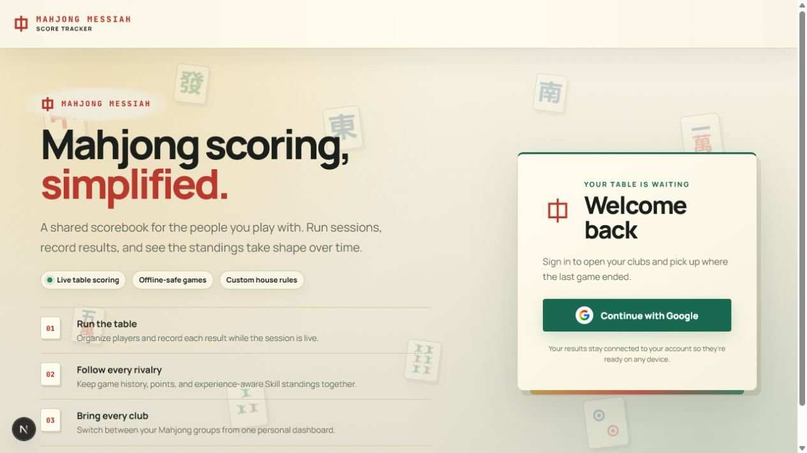
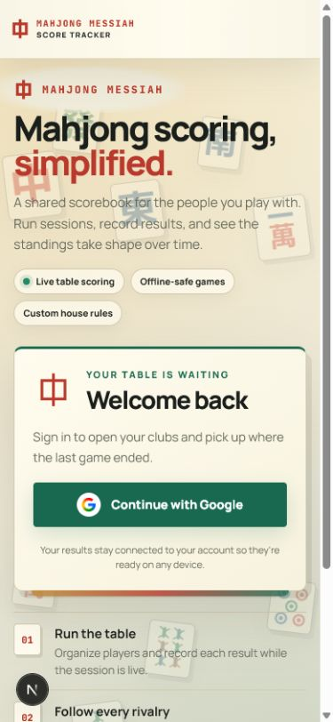
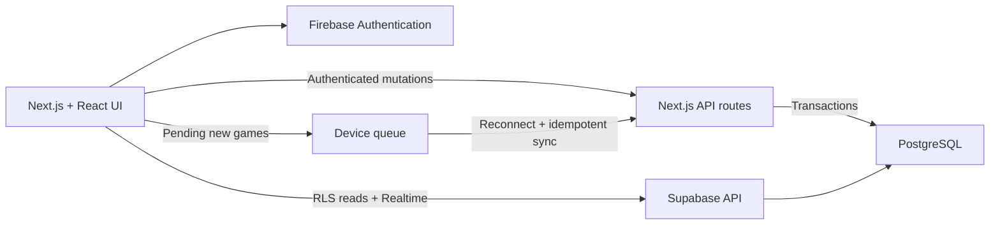

<p align="center">
  
</p>

<h1 align="center">Mahjong Messiah Score Tracker</h1>

<p align="center">
  A mobile-first scorebook for Mahjong clubs: run the room, record every result, and watch standings and rivalries evolve.
</p>

<p align="center">
  <a href="https://kens-mahjong-club-app.vercel.app/">Open the app</a>
  ·
  <a href="docs/HANDBOOK.md">Developer handbook</a>
  ·
  <a href="docs/OPERATIONS.md">Operations guide</a>
</p>

<p align="center">
  
</p>

## What it does

Mahjong Messiah keeps a club's live session and long-term history in one shared place. Players can manage a table from their phones, managers can define the club's house rules, and every saved result feeds standings, analytics, Skill ratings, and the player network.

### Built for a real Mahjong night

- **Fast live sessions.** Pick attendees, arrange up to 99 tables, swap or sideline players, and record self-draws, discard wins, or draws. Seat changes appear immediately while the database catches up.
- **Offline-safe scoring.** New games are stored on the device before syncing. If a connection drops or times out, the app keeps the result, clearly marks it as pending, and retries when connectivity returns.
- **Focused table mode.** Open a clean, phone-friendly scorekeeping view for one table, or print permanent signed QR codes so players can check in at the physical table.
- **Guest table try-out.** From the login page, enter a club code and pick an active table to score without signing in—seat players, record wins or draws, and clear the table. Guests stay locked to that table and cannot create tables, expand the session, or use club management tools.
- **Session point tracker.** Members can watch net point change over the last 24 hours, 48 hours, 7 days, or a custom From/To date range, open a game-by-game breakdown, and Float a compact chip on that club’s pages. Tap the chip to switch windows; dismiss it anytime.
- **Club-specific house rules.** Managers can set the minimum fan, maximum fan cap, and every fan-to-base-point value without changing another club.
- **Custom club titles.** Use proportional title bands or exact top/bottom counts, then add, rename, reorder, or remove titles to match the club's personality.

### Useful after the tiles are packed away

- Season and all-time standings with points, wins, win rate, and experience-aware Skill ratings
- Score and Skill analytics, detailed game logs, and a co-play/network view
- CSV import and export for historical data and external analysis
- Member-managed linked player names and emoji, plus 24-hour correction access for games a member created
- Manager tools for seasons, rosters, memberships, permissions, scoring rules, titles, and safe club deletion
- Light and dark themes, responsive dialogs, reduced-motion support, and accessible touch targets

## Mobile first

Most scoring happens beside the table, so the interface is intentionally reorganized for small screens instead of merely shrinking the desktop layout. Primary actions stay reachable, long dialogs scroll within the viewport, and focused table controls account for mobile safe areas.

<p align="center">
  
</p>

The signed-out page includes a lightweight field of real Hong Kong-style Mahjong tile symbols. They drift and collide, can be grabbed and flicked with a mouse or finger, pause when the page is hidden, and become static when reduced motion is requested.

## A session in five steps

1. Sign in with Google and open or join a club.
2. Choose the season, attending players, and number of tables.
3. Seat players from the sideline or let them scan a table QR code.
4. Record each win or draw from the session manager or focused table view.
5. Review the updated standings, analytics, logs, and player network.

## Architecture



| Area | Technology |
| --- | --- |
| Application | Next.js App Router, React, TypeScript |
| Interface | Tailwind CSS plus shared semantic tokens in `app/globals.css` |
| Authentication | Firebase Authentication and Firebase Admin |
| Data | Supabase PostgreSQL, Row Level Security, and Realtime |
| Analytics | Recharts, OpenSkill, and vis-network |
| Testing | Vitest, jsdom, and Testing Library |
| Hosting | Vercel with GitHub Actions quality gates |

Firebase provides identity only. Supabase/PostgreSQL is the application data store.

## Local development

### Requirements

- Node.js 22
- A Supabase project
- A Firebase project with Google Authentication enabled

Clone the repository, install the locked dependency graph, and create a local environment file:

```bash
npm ci
cp .env.example .env.local
```

Fill in the values documented in [`.env.example`](.env.example). Never commit `.env.local`, database credentials, service-account credentials, or production data.

Apply pending migrations, then start the development server:

```bash
npm run supabase:schema
npm run dev
```

Open [http://localhost:3000](http://localhost:3000). The checked-in `.nvmrc` and `.node-version` allow common version managers to select Node 22 automatically.

## Quality checks

| Command | Purpose |
| --- | --- |
| `npm test -- --run` | Run the complete deterministic test suite |
| `npm run lint` | Check ESLint rules |
| `npm run typecheck` | Generate Next.js route types and run TypeScript |
| `npm run security:scan` | Scan commit-eligible files for likely secrets |
| `npm run security:audit` | Audit production dependencies at moderate severity or higher |
| `npm run build` | Produce a production Next.js build |

## Database and deployment

Versioned, immutable SQL migrations live in [`supabase/migrations`](supabase/migrations). `npm run supabase:schema` applies pending files in order and records each applied filename.

Pull requests run secret and dependency scanning, linting, type checking, tests, and a production build. Merges to `main` pass the same gates before the GitHub Actions-driven Vercel deployment. Production database migrations remain a separate, manually confirmed workflow that creates an encrypted backup before applying SQL; scheduled backup runs are currently paused, while manual backups remain available.

Keep all server credentials server-only. Database connection strings, the QR signing secret, and Firebase Admin credentials must never use the `NEXT_PUBLIC_` prefix.

## Documentation

- [`docs/HANDBOOK.md`](docs/HANDBOOK.md) — architecture, domain rules, feature behavior, security, and development conventions
- [`docs/OPERATIONS.md`](docs/OPERATIONS.md) — environment setup, deployments, backups, recovery, and least-privilege database access
- [`docs/QR_TABLE_CHECKIN_SPEC.md`](docs/QR_TABLE_CHECKIN_SPEC.md) — signed permanent table QR workflow
- [`docs/audits/2026-07-16-engineering-audit.md`](docs/audits/2026-07-16-engineering-audit.md) — latest recorded engineering audit
