# Build Brief: Mobile Classical Hong Kong Mahjong Camera Coach

**Audience:** coding agent implementing this feature in this repository  
**Repository:** Ken's Mahjong Club Score Tracker (Next.js 16, React 18, TypeScript)  
**Research reviewed:** 2026-07-17  
**Status:** implementation specification; build in gated phases and do not represent experimental estimates as guaranteed advice

## 1. Mission

Build a **mobile-only, on-device camera coach for Classical Hong Kong Mahjong**. While a phone is mounted behind or above the user, the feature must:

- recognize the user's visible hand, public discards, and exposed melds;
- distinguish those zones through calibration and table geometry;
- detect a newly discarded tile as a stable event rather than reacting to a single frame;
- maintain a legal, tile-conserving game state;
- recommend a discard or a legal response: pass, chow, pong, kong, or win;
- show estimated win probability, improvement probability, deal-in risk, effective tiles, and plausible winning-hand paths;
- highlight the physical tile detection corresponding to the recommended discard in the camera overlay;
- run without a paid API, paid model host, paid database feature, or paid inference server;
- keep raw camera frames on the device and avoid writing coach state into live club/session data.

This is not one end-to-end neural network. The reliable design is a pipeline:

1. calibrated camera regions and perspective normalization;
2. a small custom tile detector initialized from pretrained weights;
3. temporal tracking, consensus, and Mahjong legality constraints;
4. an exact Classical Hong Kong rules/hand engine;
5. a belief-state probabilistic search over unseen tiles;
6. a confidence-aware mobile UI with a fast manual correction path.

The feature is successful only when all six layers work together.

## 2. Non-negotiable product constraints

### 2.1 What “100% free” means

- **Inference:** entirely inside the browser using ONNX Runtime Web. Never send frames to OpenAI, Google Vision, Roboflow, Replicate, Vercel Functions, Supabase, or another hosted inference API.
- **Serving:** model and WebAssembly assets are static, versioned files served with the existing app/Vercel deployment.
- **Training:** reproducible local scripts plus a notebook that can run on a local machine or a free notebook environment. Free notebook capacity is quota-dependent, so the project must never require it at runtime.
- **Storage:** local IndexedDB/Cache Storage for calibration, model cache, and opt-in correction samples. No cloud video storage.
- **Libraries/models:** use licenses compatible with this public repository. Record every model, weight, dataset, and artwork license in a model card.
- **CI:** use the public repository's existing GitHub Actions allocation. Keep large raw datasets out of Git history.

This definition means zero recurring software cost. It does not promise free phones, mounts, electricity, or guaranteed access to third-party free GPU quotas.

### 2.2 Privacy and data isolation

- Raw frames must not leave the device.
- Do not record video by default.
- Do not store full frames by default. Store a tile crop only after explicit opt-in and user correction.
- Stop every `MediaStreamTrack` when the coach closes, the component unmounts, the user signs out, or the page becomes hidden for a sustained interval.
- The coach is read-only with respect to Supabase club, roster, session, player, and game-log data.
- Do not put a camera frame, tile crop, model input, or advice state in analytics or logs.
- Show a persistent “Camera active · processing on this device” indicator.

### 2.3 Fair-play boundary

Live assistance can violate tournament, venue, or table rules. Before first use, show: **“Use only in practice or in games where every player allows live assistance.”** Store acknowledgement locally. Do not market the feature as undetectable assistance or a guaranteed way to win.

### 2.4 Reliability boundary

- Never invent an unreadable tile.
- Never recommend an illegal action.
- If state confidence or tile conservation fails, replace advice with **“Check table state”** and open correction mode.
- Label simulation outputs as estimates with sample count and uncertainty. “62% estimated win chance” is acceptable; “62% odds” without methodology is not.
- An explicit **Unknown** observation is safer than a confident wrong class.

## 3. Research findings and how they constrain this design

The implementation agent must read the linked primary sources before changing the architecture.

| Source | Relevant result | Design consequence | Limitation |
|---|---|---|---|
| [Suphx: Mastering Mahjong with Deep Reinforcement Learning](https://arxiv.org/abs/2003.13590) | Treats Mahjong as a multi-player imperfect-information problem and combines global reward prediction, oracle guidance, and runtime policy adaptation. | Model hidden information as a belief distribution and optimize expected outcome, not just hand shape. | Trained for Japanese/Tenhou play with large-scale compute; its policy is not a Classical Hong Kong drop-in model and is not realistic to reproduce for free. |
| [Building a Computer Mahjong Player via Deep Convolutional Neural Networks](https://arxiv.org/abs/1906.02146) | Encodes observable table information and reports separate prediction strategies for discard and calls such as pon/chi/kan. | Keep public table state explicit and evaluate each action type against pass. Separate legal-action/value heads are a future option. | Japanese rules and imitation accuracy are not proof of optimality or Hong Kong compatibility. |
| [Let's Play Mahjong!](https://arxiv.org/abs/1903.03294) and [A Fast Algorithm for Computing the Deficiency Number of a Mahjong Hand](https://arxiv.org/abs/2108.06832) | Formalize hand deficiency and algorithms for completion-oriented discard decisions. | Implement an exact, memoized deficiency/shanten and effective-tile core before probabilistic search. | Completion distance alone ignores scoring value, opponent danger, calls, and house rules. |
| [Projection Mahjong: augmenting real-world Mahjong experience](https://link.springer.com/article/10.1007/s11042-026-21151-7) | Fine-tunes pretrained ResNet-18 classifiers and a modified YOLACT tile model, crops task-specific regions, performs keystone correction, requires repeated detections for events, and reports roughly 99% tile recognition. | Use calibration, region-specific crops, custom fine-tuning, perspective handling, and multi-frame confirmation. | It uses a fixed tabletop rig and an RTX 3070 Ti laptop; the data are not public. Its result does not establish equivalent mobile-browser performance. |
| [ByteTrack: Multi-Object Tracking by Associating Every Detection Box](https://arxiv.org/abs/2110.06864) | Associates detections across time and recovers objects through lower-confidence observations. | Track tiles over time and aggregate evidence instead of treating every frame independently. | Full ByteTrack is unnecessary for mostly stationary tiles; begin with lightweight IoU/Kalman association and adopt more only if replay tests justify it. |
| [Real-Time Object Detection for Streaming Perception](https://openaccess.thecvf.com/content/CVPR2022/html/Yang_Real-Time_Object_Detection_for_Streaming_Perception_CVPR_2022_paper.html) | Evaluates online perception as an accuracy-plus-latency problem. | Measure event-to-advice latency and stale detections, not only still-image mAP. | Autonomous-driving methods are much larger than this use case needs. |
| [Opponent-Model Search in Games with Incomplete Information](https://ojs.aaai.org/index.php/AAAI/article/view/28844) | Shows why opponent assumptions affect decisions under incomplete information and distinguishes optimal from robust strategies. | Keep the opponent model replaceable, expose uncertainty, and offer conservative/neutral/aggressive risk profiles. | This is a general game-theory framework, not a Mahjong policy. |
| [ONNX Runtime Web documentation](https://onnxruntime.ai/docs/tutorials/web/) | Supports in-browser ONNX inference using WebAssembly, WebGPU, WebGL, and WebNN providers; on-device inference improves privacy and avoids cloud cost. | Use WebGPU when supported and a tested WASM fallback. Self-host matching runtime assets. | [Official browser support](https://onnxruntime.ai/docs/get-started/with-javascript/web.html) does not provide WebGPU on iOS; iPhone support must meet its budget on WASM or a validated WebGL fallback. |
| [MediaDevices.getUserMedia](https://developer.mozilla.org/en-US/docs/Web/API/MediaDevices/getUserMedia) and [requestVideoFrameCallback](https://developer.mozilla.org/en-US/docs/Web/API/HTMLVideoElement/requestVideoFrameCallback) | Provide permissioned rear-camera capture in secure contexts and efficient frame callbacks. | Require HTTPS/localhost, request the environment camera, use `playsInline`, and process frames using `requestVideoFrameCallback` with a fallback scheduler. | Permission, camera choice, and frame rate vary by browser/device and require real-device testing. |

### Research conclusion

There is no credible, license-verified, drop-in pretrained model in these sources that recognizes arbitrary physical Classical Hong Kong tile sets from a phone camera. “Pretrained” must mean **start from an open pretrained detector/backbone and fine-tune it on licensed physical Mahjong imagery**. Do not ship a COCO model and claim that it recognizes Mahjong.

The 99% per-tile figure reported by a related system is also not sufficient by itself: if 13 classifications were independent at 99%, the chance that an entire 13-tile hand is correct would be only about `0.99^13 = 87.8%`. Temporal consensus, geometry, tile-count constraints, and correction UI are therefore mandatory.

### Candidate open data and code found during the cross-agent review

These sources can reduce bootstrap work, but “publicly downloadable” is not the same as “safe to copy into a public product.” Record source, asset-level license, attribution, class mapping, and provenance before an image enters training.

| Candidate | Verified useful fact | Approved use | Caveat |
|---|---|---|---|
| [Roboflow Mahjong_YOLO](https://universe.roboflow.com/test-wmo8i/mahjong_yolo) | The dataset page declares CC BY 4.0 and describes a 4,483-image exported dataset. | Candidate bootstrap data with required attribution, followed by physical-set fine-tuning. | The current hosted model page also shows inconsistent image/class counts and very weak published model metrics. Download and audit the actual dataset; do not use its hosted API or accept its model as production quality. |
| [Camerash/mahjong-dataset](https://github.com/Camerash/mahjong-dataset) | Contains labeled crops for all 42 Chinese tile faces and declares MIT at repository level. | Label-map/classifier prototyping and a local comparison benchmark. | Its README says images were largely scraped from Google Images, eBay, and Alibaba. A repository MIT file cannot necessarily relicense third-party images. Do not redistribute the images or derived production weights without a provenance review. |
| [DrCheeseFace/mahjonging](https://github.com/DrCheeseFace/mahjonging) | Demonstrates a roughly 7,000-image YOLOv8 Mahjong experiment and exposes MIT repository code. | Architectural reference only. | The project describes itself as under heavy development, does not establish dataset provenance or mobile metrics, and YOLOv8 introduces a separate Ultralytics AGPL/commercial-license decision. |
| [smilee3998/mahjong_detection](https://github.com/smilee3998/mahjong_detection) | Demonstrates YOLO detection plus geometric/RANSAC handling and includes dataset-conversion ideas. | Reference preprocessing and evaluation ideas after checking each file's license. | It is YOLOv11/Ultralytics based and is not evidence of Classical Hong Kong mobile accuracy. Do not copy code/data until licenses are confirmed. |
| [realtime-mahjong-trainer](https://github.com/heyzec/realtime-mahjong-trainer) and [Akagi](https://github.com/shinkuan/Akagi) | Show practical live-state/advice UI patterns and modular recommendation pipelines. | UX and module-boundary references. | Both target Japanese/online-game contexts rather than a physical Classical Hong Kong table. Do not transfer rules or policy outputs. |

The safest production dataset is still: user-owned physical-tile photos with explicit consent, plus clearly licensed CC BY/CC0 material, split by recording session and physical set. Keep a `DATASET_SOURCES.csv` with one row per source collection and fail the model-release checklist if any row has `license_status != approved`.

### Existing solver/scoring references

- [MahjongRepository/mahjong](https://github.com/MahjongRepository/mahjong) is MIT and reports validating its Japanese Riichi calculator across 26,148,038 Tenhou hands. Use its shanten tests/algorithm as a permissive reference, not its Japanese scoring rules.
- [mahjong-utils](https://github.com/ssttkkl/mahjong-utils) is a Kotlin Multiplatform Japanese Riichi analysis library with JavaScript output. Evaluate it as a reference oracle, but do not add its runtime/bundle until profiling and HK-rule separation justify it.
- [`hk-mahjong`](https://github.com/HSKPeter/hk-mahjong-hand-calculation) is an MIT TypeScript/Node library that explores winning decompositions and calculates Hong Kong faan. Its latest npm release is 3.2.0 (2023). Use it first as a development oracle and source of golden cases; adopt it as a production dependency only after its supported patterns match `hk-classical-v1`, its CJS/Next.js integration is clean, and differential tests pass.

Do not implement shanten/deficiency from memory. Base the owned TypeScript implementation on the cited mathematical papers and permissively licensed references, preserve required notices, and validate it independently. An owned pure TypeScript hot path is preferred over shipping a large or rule-mismatched runtime dependency.

## 4. Feasible operating setup

The production experience must guide the user into a reproducible camera setup:

1. Mount the phone in landscape behind and slightly above the user's seat, angled down so the camera sees the faces of the user's tiles and the public center of the table.
2. Require 1080p capture when available, falling back gracefully. Each recognized tile face should be at least roughly 48 px on its short dimension; warn if calibration indicates less.
3. Ask the user to tap the four table corners, the four corners of their hand region, and the discard/meld regions. Store the homography and normalized regions locally, keyed by camera device, orientation, and table profile.
4. Show a live quality gate for blur, glare, brightness, camera motion, and tile pixel size. Do not enter automatic mode until it passes.
5. Ask which seat is the user and which Classical Hong Kong rules profile applies.

One handheld camera cannot reliably view the table continuously while the user plays. A mount is a functional requirement for automatic real-time mode. A handheld **Snapshot Coach** may be offered, but it is a separate, slower mode.

## 5. High-level architecture

```mermaid
flowchart LR
    Camera["Rear camera frames"] --> Cal["Calibration and ROI crops"]
    Cal --> Detect["ONNX tile detector"]
    Detect --> Track["Tracking and temporal consensus"]
    Track --> Validate["Tile conservation and state machine"]
    Validate --> Public["Observed public game state"]
    Public --> Rules["Exact HK rules and legal actions"]
    Public --> Belief["Unseen-tile belief model"]
    Rules --> Search["Root-action Monte Carlo search"]
    Belief --> Search
    Search --> Advice["Recommendation plus uncertainty"]
    Advice --> Overlay["Camera overlay and metric drawer"]
    Validate --> Correct["Manual correction UI"]
    Correct --> Public
```



All blocks after camera capture run on the device. The UI thread owns camera/video rendering. Detection and simulation run in separate workers or a coordinated worker scheduler so that camera preview and controls remain responsive.

## 6. Classical Hong Kong rules are a versioned dependency

“Classical Hong Kong Mahjong” is not one completely uniform ruleset. Do not silently import Japanese Riichi assumptions. Before exposing strategic advice, create a versioned rules profile and golden tests for the app's actual house rules.

Create `lib/mahjong-hk/rules/hk-classical-v1.ts` with at least:

- 34 base tile types, four copies each;
- optional 8 flowers/seasons and replacement-draw behavior;
- minimum fan required to win (seed the profile with the app's current 3-fan convention, but make it explicit);
- fan/point cap (the current app caps payout at 13 fan; do not assume that defines all hand scoring);
- allowed special hands;
- concealed/exposed scoring differences;
- self-draw and discard-win payments;
- dealer/seat/round wind behavior if used;
- chow direction and restrictions;
- concealed, exposed, and added kong rules, replacement draw, robbing a kong, and last-tile rules;
- flower/season fan and seat matching;
- mutually compatible and mutually exclusive patterns.

The current [`lib/table-scoring.ts`](../lib/table-scoring.ts) is a **payout calculator**, not a winning-hand recognizer or strategy engine. It can be called only after the new rules engine produces a validated fan total. Do not expand it into a giant mixed-purpose file.

### Required tile identifiers

Use stable machine identifiers, never display strings, as state keys:

```ts
export type BaseTileId =
  | 'characters_1' | 'characters_2' | 'characters_3' | 'characters_4' | 'characters_5'
  | 'characters_6' | 'characters_7' | 'characters_8' | 'characters_9'
  | 'bamboo_1' | 'bamboo_2' | 'bamboo_3' | 'bamboo_4' | 'bamboo_5'
  | 'bamboo_6' | 'bamboo_7' | 'bamboo_8' | 'bamboo_9'
  | 'dots_1' | 'dots_2' | 'dots_3' | 'dots_4' | 'dots_5'
  | 'dots_6' | 'dots_7' | 'dots_8' | 'dots_9'
  | 'east' | 'south' | 'west' | 'north'
  | 'red_dragon' | 'green_dragon' | 'white_dragon'

export type BonusTileId =
  | 'flower_plum' | 'flower_orchid' | 'flower_chrysanthemum' | 'flower_bamboo'
  | 'season_spring' | 'season_summer' | 'season_autumn' | 'season_winter'
```

Internally map the 34 base tiles to integers `0..33` and represent concealed hands with a `Uint8Array(34)`. This makes memoization and worker transfer cheap. Bonus tiles are tracked separately because they do not form ordinary melds.

## 7. Exact rules and hand-analysis engine

Build and test this engine **before camera recognition**.

### 7.1 Required pure functions

```ts
type Meld = {
  kind: 'chow' | 'pong' | 'kong'
  tiles: BaseTileId[]
  exposed: boolean
  fromSeat?: 0 | 1 | 2 | 3
}

type HandState = {
  concealed: Uint8Array
  melds: Meld[]
  bonusTiles: BonusTileId[]
  drawnTile?: BaseTileId
  seatWind: 'east' | 'south' | 'west' | 'north'
  roundWind?: 'east' | 'south' | 'west' | 'north'
}

export function isWinningHand(hand: HandState, rules: HkRules): WinResult | null
export function deficiency(hand: HandState, rules: HkRules): number
export function enumerateWaits(hand: HandState, rules: HkRules): BaseTileId[]
export function effectiveTiles(hand: HandState, visible: VisibleTiles, rules: HkRules): EffectiveTile[]
export function legalActions(state: ObservedGameState, event: GameEvent, rules: HkRules): LegalAction[]
export function scoreWin(hand: HandState, context: WinContext, rules: HkRules): ScoredWin
```

### 7.2 Solver approach

- Use recursive decomposition plus memoization over the 34-count vector, number of existing melds, and pair-needed flag.
- Add special-hand evaluators as independent, tested modules rather than distorting the standard four-meld-and-pair recursion.
- Compute deficiency for every supported hand family and retain both the minimum distance and candidate paths.
- Enforce hand-size invariants, declared-meld count, replacement draws, and at most four copies of every base tile.
- Cache immutable results. Avoid JSON-stringifying arrays in hot loops; use a compact base-5 or binary key.
- Run exhaustive small-state/property tests to prove that adding a declared meld changes the target concealed structure correctly.

## 8. Observed state, events, and belief state

### 8.1 Observed state

```ts
type Confidence = { score: number; samples: number; lastSeenMs: number }

type ObservedGameState = {
  hand: HandState
  discardsBySeat: BaseTileId[][]
  exposedMeldsBySeat: Meld[][]
  bonusTilesBySeat: BonusTileId[][]
  activeSeat: 0 | 1 | 2 | 3 | null
  userSeat: 0 | 1 | 2 | 3
  tilesRemainingEstimate: number
  lastEvent: GameEvent | null
  observationConfidence: number
  rulesVersion: string
}
```

Never expose a recommendation until `validateObservedState` succeeds. Validation includes tile conservation, legal hand size, event ordering, and region confidence.

### 8.2 Event state machine

Events, not raw detections, drive advice:

- `INITIAL_STATE_CONFIRMED`
- `USER_DRAW_INFERRED` / `USER_DRAW_CONFIRMED`
- `DISCARD_DETECTED(seat, tile, trackId)`
- `CALL_DETECTED(seat, chow|pong|kong, tiles)`
- `CALL_RETRACTED` when a discard is claimed
- `USER_DISCARD_CONFIRMED`
- `REPLACEMENT_DRAW_INFERRED`
- `ROUND_RESET`
- `MANUAL_CORRECTION`

A new discard event requires all of:

1. a new track in the calibrated discard region;
2. the same class in at least 3 of the latest 5 detector observations (make this threshold configurable after replay evaluation);
3. stable centroid/size for at least 150–300 ms;
4. a confidence threshold calibrated on validation data;
5. a resulting legal tile-conserving state.

If an existing discard is moved or a hand occludes the region, preserve its track through a short grace interval. If ambiguity remains, vibrate/show a small confirmation chip rather than creating two events.

#### Seat-attribution scope

A single angled phone may see that a new public discard exists without reliably seeing which player placed it. Do not guess the source seat because chow legality depends on it.

- **v1:** support one shared discard region. A new tile may trigger win/pong/kong evaluation immediately. Show chow only when the source is known; otherwise show a one-tap **From player before me / Other seat** confirmation chip.
- **v1.5:** allow four calibrated seat-specific discard regions when the full center is visible and replay metrics pass.
- **v2/stretch:** infer source from motion/track history only after per-seat precision reaches the same 0.99 committed-event gate. Keep the confirmation fallback.

Unknown source is valid state (`sourceSeat: null`), not an error. Advice should clearly say when source uncertainty prevents a chow recommendation.

### 8.3 Belief state

For every base tile `t`:

```text
unseen[t] = 4
            - own_concealed[t]
            - all_visible_discards[t]
            - all_exposed_melds[t]
            - any_other_publicly_visible_copy[t]
```

Sample walls and opponent concealed hands **without replacement** from this multiset. Condition samples on public information when justified (melds, legal hand sizes, and later a replaceable discard-tendency model). Never inspect or infer hidden opponent tiles as facts.

For a fixed set of `E` effective unseen tiles among `U` unseen tiles, the exact probability of seeing at least one within `n` draws without replacement is:

```text
P(improve within n draws) = 1 - C(U - E, n) / C(U, n)
```

Use this only for a fixed effective-tile set. Once draws change future waits, use simulation.

## 9. Recommendation engine

### 9.1 Practical “best possible” engine under the free/on-device constraint

Implement a hybrid of:

1. exact legality, hand completion, fan scoring, and effective-tile counts;
2. exact short-horizon hypergeometric calculations;
3. root-parallel belief-state Monte Carlo rollouts for each legal action;
4. a simple, replaceable opponent hazard model based only on public actions;
5. deterministic seeded evaluation for tests and time-budgeted adaptive sampling in production.

Do **not** attempt to reproduce Suphx-scale deep reinforcement learning as the first implementation. It is rule-mismatched, data-hungry, costly to reproduce, hard to validate, and unnecessary for a useful v1.

### 9.2 Action comparison

At each decision event:

1. Generate every legal action: win, pass, each discard, each chow shape, pong, each legal kong.
2. Apply the action to an immutable state.
3. Sample hidden hands and wall orders consistent with the public state.
4. Simulate future play using a baseline policy that prioritizes legal wins, lower deficiency, more live effective tiles, expected fan, and bounded risk.
5. Aggregate outcomes by action.
6. Compare a call with **pass**; never recommend chow/pong/kong merely because it is legal.
7. Stop when the time budget is reached or confidence intervals separate enough to choose safely.

An initial utility can be:

```text
utility = expected_points_won
          - riskProfile * expected_points_lost
          - uncertaintyPenalty
          - handExposurePenalty
```

Do not hand-tune this into an opaque magic score. Return its components and test monotonic properties. A higher chance of a larger legal win should not lower neutral utility when every other component is equal.

### 9.3 Search budgets

- Return exact deficiency/effective-tile advice immediately, normally under 20 ms.
- Target at least 2,000 total rollouts for a quick update and continue refining up to 10,000–20,000 while the table is unchanged.
- First strategic result: no more than 250 ms after a confirmed event on the target mid-range device.
- Cancel stale search with an `AbortSignal`/generation token as soon as a new event arrives.
- Reuse belief samples across root actions (common random numbers) to reduce comparison noise.
- Include `rolloutCount`, seed/version, and a 95% interval with every estimated win probability.

### 9.4 Metrics shown to the user

The compact overlay shows only:

- **Recommended action** and tile image/name;
- **Estimated win chance** with a range, e.g. `24% (21–27%)`;
- **Improvement next draw**;
- **Risk**: low/medium/high plus numeric estimate when calibrated;
- **State confidence**.

An expandable drawer shows:

- deficiency/distance to a legal win;
- live effective tiles and remaining visible counts;
- improvement within 1, 2, and 4 own draws;
- expected fan/points under the active rules profile;
- top candidate actions with expected utility;
- top winning paths as both `P(win via pattern)` and `P(pattern | win)` so overlapping labels are not misleading;
- rollout count, state age, model version, and uncertainty.

Never imply that `P(improve)` and `P(win)` are the same metric.

### 9.5 Future learned strategy model

Only after the exact/Monte Carlo engine has replay benchmarks may a small learned value or opponent model be added. Train it from licensed Classical Hong Kong data or simulator self-play, use it to rank/initialize search, and retain the exact legal-action mask. It must be an optional acceleration/quality layer, not the sole authority.

## 10. Vision pipeline

### 10.1 Recommended model

Use [YOLOX-Nano](https://github.com/Megvii-BaseDetection/YOLOX) (Apache-2.0 code) or an equivalently licensed tiny detector initialized from open pretrained weights, fine-tuned for the physical tile domain, exported to ONNX, and quantized. Do not introduce an AGPL model without documenting the distribution consequences.

Start with one detector having these output classes:

- the 34 `BaseTileId` classes;
- the 8 `BonusTileId` classes when the rules profile enables them;
- `tile_back`.

“Unknown” is a runtime rejection result, not a class the engine is forced to choose. If one-stage class reliability is below target, add a MobileNetV3-small crop verifier and accept a tile only when detector and verifier agree or the temporal posterior is decisive.

Recommended artifacts:

```text
public/models/hk-classical-v1/
  detector.int8.onnx
  detector.fp16.onnx              # optional WebGPU path
  labels.json
  manifest.json                   # hashes, input shape, thresholds, license, metrics
  MODEL_CARD.md
```

Target total compressed model payload under 10 MB, and do not exceed 20 MB without a measured accuracy justification.

### 10.2 Region-first recognition

Do not ask the network to guess “my hand” versus “discard pile” from appearance. Use calibrated geometry:

- `MY_HAND` — high-resolution crop and stricter class threshold;
- four `DISCARD_<SEAT>` regions or a center region subdivided by calibrated seat geometry;
- `EXPOSED_MELDS_<SEAT>` regions;
- `BONUS_<SEAT>` regions;
- ignored wall/hidden-hand regions.

Apply a table homography/keystone correction before region extraction. Save normalized coordinates rather than raw pixels. Detect camera movement by tracking calibration anchors/table edges; pause and request recalibration after sustained drift.

### 10.3 Frame scheduling

- Render the preview at the camera's natural rate.
- Use `requestVideoFrameCallback`; fall back to `requestAnimationFrame` plus timestamp throttling.
- Run detector inference at an adaptive 5–10 FPS, not on every 30/60 FPS preview frame.
- Increase rate for 1–2 seconds after motion in a relevant region, then reduce it for battery/heat.
- Process ROI crops before resizing to the model input so distant public tiles retain pixels.
- Reuse canvas/tensor buffers; do not allocate a full frame array every callback.
- Transfer `ImageBitmap`/typed buffers to the worker when supported and close/release them promptly.

### 10.4 Tracking and temporal consensus

Use a lightweight two-stage association inspired by ByteTrack:

1. associate high-confidence boxes to existing tracks using region, IoU, centroid distance, size, and class posterior;
2. use lower-confidence detections only to maintain an existing track, not to create an event;
3. retain unmatched tracks briefly through hand occlusion;
4. aggregate class logits/probabilities across recent frames;
5. commit an observation only after stability and Mahjong constraints agree.

Tiles in a discard region are mostly stationary, so full person-tracking/re-identification is unnecessary. The replay benchmark decides whether a Kalman filter adds value over centroid velocity and IoU.

### 10.5 Correction and personalization

Long-press any overlay box to:

- choose the correct tile;
- mark it unknown/ignored;
- move it to a different semantic region;
- undo the most recent event.

After explicit opt-in, save the rectified crop, corrected label, lighting metadata, model version, and confidence to IndexedDB. Provide **Export training samples** as a ZIP/JSON bundle with no full frames or EXIF. This is the no-cost path to improve a user's particular physical set.

## 11. Dataset and training pipeline

### 11.1 Data requirements

Collect data from physical Classical Hong Kong sets, not only digital game sprites. Include:

- every tile face and back;
- multiple physical sets/art styles;
- distances and angles matching the mounted phone;
- bright/dim/warm/cool lighting, shadows, glare, blur, and white balance shifts;
- partial hand occlusion, touching tiles, rotations, and distant discard tiles;
- hard negatives: tile walls, racks, hands, phones, score sticks, table graphics, and empty regions.

Start with at least several hundred varied instances per class after augmentation, then let validation errors—not an arbitrary count—drive more collection. Split train/validation/test by **recording session and physical set**, never by random video frames, to prevent near-duplicate leakage.

Use synthetic augmentation only as a supplement. Perspective, blur, glare, occlusion, copy/paste, color shift, and scale augmentation are useful; synthetic validation images are not an acceptance test.

### 11.2 Free toolchain and repository layout

```text
ml/
  README.md
  requirements.lock.txt
  configs/hk_classical_v1.yaml
  train_detector.py
  evaluate_detector.py
  export_onnx.py
  quantize_onnx.py
  notebooks/train_hk_tile_detector.ipynb
  data/                             # gitignored
  reports/                          # aggregate metrics, no private frames
```

- Train with PyTorch/YOLOX locally or in a free notebook runtime.
- Use a free, open-source local annotation tool or a small repository-owned annotation page.
- Export a static-shape ONNX model.
- Produce INT8 for WASM and, if measurements justify it, FP16 for WebGPU.
- Compare quantized accuracy against FP32 before publishing.
- Pin Python dependencies and record commands, seed, source commit, dataset hash, and model hash.
- Never download an unverified community weight at application runtime.

### 11.3 Model card requirements

For every shipped model record:

- intended use and non-use;
- label map and supported tile sets;
- architecture and pretrained-weight source/license;
- dataset provenance, consent, and license;
- split methodology;
- per-class precision/recall/F1 and confusion matrix;
- detection mAP and exact stabilized-hand accuracy;
- event precision/recall and false events per hour on full video replays;
- Android/iPhone latency, memory, battery/thermal observations;
- known failure modes;
- SHA-256 for every model/runtime asset.

## 12. Integration with this repository

### 12.1 Critical existing header change

[`next.config.mjs`](../next.config.mjs) currently sends:

```text
Permissions-Policy: camera=(), microphone=(), geolocation=()
```

That explicitly blocks this feature. Change camera permission to same-origin only, for example:

```text
Permissions-Policy: camera=(self), microphone=(), geolocation=()
```

Keep microphone and geolocation disabled. Verify the final deployed response header because duplicate/conflicting policies can still block capture.

Do not globally change `Cross-Origin-Opener-Policy` merely to obtain threaded WASM: this app uses Firebase popup authentication, and stricter global isolation can regress it. Begin with a Web Worker and single-threaded WASM fallback. Consider route-specific COOP/COEP only after Google/email/phone auth regression tests and same-origin model/WASM loading pass.

### 12.2 Suggested source layout

```text
app/club/[clubId]/coach/page.tsx
components/coach/
  CameraCoach.tsx
  CameraPreview.tsx
  CalibrationWizard.tsx
  CoachOverlay.tsx
  AdviceCard.tsx
  MetricsDrawer.tsx
  StateCorrectionSheet.tsx
  RulesProfileSheet.tsx
lib/mahjong-hk/
  tiles.ts
  state.ts
  validation.ts
  hand-solver.ts
  deficiency.ts
  legal-actions.ts
  scoring.ts
  belief-state.ts
  rollout-policy.ts
  recommendation.ts
  rules/hk-classical-v1.ts
lib/coach-vision/
  model-manifest.ts
  regions.ts
  homography.ts
  tracker.ts
  consensus.ts
  event-machine.ts
  calibration-store.ts
workers/
  coach-vision.worker.ts
  coach-search.worker.ts
public/models/hk-classical-v1/
__tests__/mahjong-hk/
__tests__/coach-vision/
```

### 12.3 Runtime integration

- Add `onnxruntime-web` and commit the lockfile.
- Self-host the exact matching ORT `.wasm` assets; do not use a CDN.
- Lazy-load all coach code and model assets only after the user opens the coach. The normal club/dashboard bundles must not gain the ML payload.
- Construct workers using `new Worker(new URL(..., import.meta.url), { type: 'module' })` in client-only code.
- Cache versioned immutable model assets with Cache Storage. Validate their hash against `manifest.json` before use.
- Prefer execution providers in measured order, normally WebGPU then WASM on supported Android/desktop debug devices; use WASM or a separately validated WebGL fallback on iOS. Never assume WebGPU on iPhone.
- Detect device capability on first launch, run a short non-camera benchmark, and store the chosen model/provider locally.
- Keep recommendation state local. Reading the user's club rules/profile is acceptable; mutating session tables or game logs is not.

### 12.4 Mobile-only entry point

Add **Camera coach** to the club workspace on coarse-pointer mobile layouts. The route must still be reachable on desktop with `?debugCoach=1` in development/test, but production desktop users see an explanation rather than camera controls.

Use capability detection, not user-agent sniffing:

```ts
const mobileCapable = matchMedia('(pointer: coarse)').matches
  && matchMedia('(max-width: 900px)').matches
  && !!navigator.mediaDevices?.getUserMedia
```

Authentication and club membership continue to use existing app controls. The feature should not require a new database table for v1.

## 13. Mobile UX

### 13.1 First-run flow

1. Fair-play and privacy acknowledgement.
2. Rules profile/house-rule confirmation.
3. Mounting illustration and camera permission.
4. Landscape orientation and table-corner calibration.
5. Mark **My hand**, discard regions, and exposed-meld regions.
6. Live quality checks.
7. Confirm detected initial state using a tile-strip editor.
8. Enter live coach.

### 13.2 Live layout

- Full-bleed camera preview with correctly transformed overlay boxes.
- Recommended discard has a thick, animated outline plus a label such as **DROP 7 DOTS**; never rely on color alone.
- Newly detected opponent discard briefly pulses and shows its class/confidence.
- A bottom action card shows `PASS`, `CHOW`, `PONG`, `KONG`, or `WIN`, the estimated benefit over pass, and a short reason.
- Compact top status: camera, model/provider, rules version, state confidence, table freshness.
- Metrics and correction are bottom sheets, sized below browser safe-area insets.
- Large **Pause** and **Correct** controls remain reachable with one thumb.
- Haptic/audio cues use existing user preferences and never auto-play until a user gesture has enabled audio.

### 13.3 Failure UX

Pause recommendations and explain the single next step when:

- more than four visible copies of a tile are inferred;
- hand count is invalid;
- camera moved or orientation changed;
- image is too blurry/dark/glared;
- relevant regions are occluded too long;
- event order is impossible;
- model/runtime fails to initialize;
- confidence is below its calibrated threshold.

Always preserve the manual hand-entry coach as a fallback. The decision engine must remain useful even when the camera cannot be trusted.

## 14. TypeScript worker contracts

Use discriminated, versioned messages. Do not pass React objects/functions into workers.

```ts
type VisionWorkerRequest =
  | { v: 1; type: 'INIT'; manifestUrl: string; preferredProviders: string[] }
  | { v: 1; type: 'CALIBRATE'; calibration: CalibrationProfile }
  | { v: 1; type: 'FRAME'; frameId: number; capturedAt: number; bitmap: ImageBitmap }
  | { v: 1; type: 'CORRECT'; trackId: string; tile: BaseTileId | BonusTileId | null }
  | { v: 1; type: 'STOP' }

type VisionWorkerResponse =
  | { v: 1; type: 'READY'; provider: string; modelVersion: string }
  | { v: 1; type: 'OBSERVATIONS'; frameId: number; observations: TileObservation[]; inferenceMs: number }
  | { v: 1; type: 'EVENT'; event: GameEvent; stateConfidence: number }
  | { v: 1; type: 'NEEDS_CONFIRMATION'; reason: string; candidates: TileObservation[] }
  | { v: 1; type: 'ERROR'; recoverable: boolean; code: string }

type Recommendation = {
  rulesVersion: string
  stateVersion: number
  action: LegalAction
  reasonCodes: string[]
  winProbability: { mean: number; low95: number; high95: number }
  improveNextDraw: number
  expectedPoints: number
  dealInRisk: number | null
  expectedUtility: number
  alternatives: ActionEvaluation[]
  handPaths: HandPathProbability[]
  rolloutCount: number
  elapsedMs: number
  confidence: number
}
```

Discard any recommendation whose `stateVersion` is no longer current.

## 15. Implementation sequence (small, reviewable pull requests)

### PR 0 — rules decision record and fixtures

- Add this brief and an ADR freezing `hk-classical-v1` assumptions.
- Add at least 50 human-readable golden hands/outcomes from the chosen rules.
- Add feature flag `mahjongCameraCoach` defaulting off in production.

**Exit:** house rules are explicit; no camera or strategy code yet.

### PR 1 — exact manual coach

- Tile types, state validation, hand solver, deficiency, waits, effective tiles, legal actions, and scoring.
- Mobile manual tile editor.
- Pure unit/property tests.

**Exit:** given a perfect manually entered state, every shown action is legal and the engine explains its immediate hand-shape result.

### PR 2 — probabilistic engine

- Unseen-tile accounting, hypergeometric metrics, seeded rollouts, action comparison, confidence intervals, and Web Worker.
- Simulator/replay harness and calibration report for probability estimates.

**Exit:** deterministic tests pass; search returns within budget and never blocks UI.

### PR 3 — camera shell and calibration

- Same-origin permission header, mobile route, privacy flow, rear camera, landscape UI, table/ROI calibration, drift and image-quality checks.
- No ML recognition yet; render test boxes and use a prerecorded test adapter.

**Exit:** camera lifecycle is leak-free on real Android Chrome and iOS Safari and existing Firebase auth still works.

### PR 4 — still-frame detector

- Reproducible dataset/training/export pipeline, model card, ONNX worker, still-frame inference, correction sheet, and model caching.

**Exit:** held-out physical-set metrics meet the still-image thresholds below; no real-time event claims yet.

### PR 5 — streaming state and overlay

- Adaptive scheduling, tracking, consensus, semantic regions, initial-state confirmation, and visual highlight.
- Replay-video evaluation with forced occlusion/glare/rearrangement cases.

**Exit:** exact stabilized-hand and full-video event metrics meet thresholds.

### PR 6 — live event-to-advice integration

- Connect confirmed events to legal actions/search, call-vs-pass comparison, cancellation of stale work, metrics drawer, pause/correction workflow.
- Manual and automated regression tests for all current app features.

**Exit:** end-to-end latency/reliability targets pass on target phones; feature flag may be enabled for an opt-in beta.

### PR 7 — optional personalization/value model

- Local corrected-crop export and set-specific fine-tuning workflow.
- Consider a learned value/opponent model only when it beats the exact/rollout baseline on held-out replays without harming calibration.

## 16. Tests and quality gates

### 16.1 Rules/engine tests

- Golden tests for every supported winning pattern, fan combination, minimum-fan rejection, special hand, chow/pong/kong form, replacement draw, and payment mode.
- Property: no legal state contains more than four of a base tile.
- Property: `legalActions` returns only actions that transition to another valid state.
- Property: a claimed chow is offered only from the allowed seat and only for suited consecutive tiles.
- Property: every recommendation belongs to `legalActions`.
- Property: identical state, rules, and seed produce identical rollouts.
- Property: exact hypergeometric results match enumeration for small toy walls.
- Exhaustively compare hand solver/deficiency with a slow reference solver over reduced state spaces.

### 16.2 Vision tests

- Unit tests for normalized-to-screen transforms in every orientation and mirrored/non-mirrored preview.
- Recorded replay fixtures for draws, discards, claimed discards, exposed melds, occlusion, tile movement, glare, blur, and camera drift.
- Ensure three unstable frames cannot create three events.
- Ensure an unknown/low-confidence tile pauses state rather than selecting the top class.
- Ensure correction reverses/recomputes downstream state and advice.
- Ensure stale worker messages cannot update a new state.

### 16.3 Security/privacy tests

- Assert no coach request reaches `/api/*`, Supabase, Firebase Storage, or third-party origins during inference.
- Assert camera tracks stop on close, unmount, sign-out, and sustained backgrounding.
- Assert stored correction records contain crops only after opt-in and never full frames.
- Assert deployed `Permissions-Policy` permits only same-origin camera and keeps microphone/geolocation disabled.
- Verify model hashes and reject mismatches.
- Keep model/WASM URLs same-origin and compatible with the CSP.

### 16.4 Existing app regression gates

Run all existing checks for every implementation PR:

```bash
npm test -- --run
npm run lint
npm run typecheck
npm run security:scan
npm run build
```

Add deterministic coach tests to the normal `npm test -- --run` suite. Do not make CI download training data or train a model.

## 17. Acceptance thresholds

These are release gates, not aspirations. Report results separately by physical tile set and device.

### Correctness

- 100% of recommendations are legal under the selected rules profile.
- 100% of impossible tile-conservation states suppress recommendations.
- Golden hand/scoring suite passes completely.
- Perfect-input engine matches the slow reference solver on the exhaustive/replay suite.

### Vision

- Per-class macro F1 at least 0.99 on held-out physical-set still images.
- Stabilized **whole-hand exact match** at least 0.98 on the supported physical set/setup.
- New-discard event precision at least 0.99 and recall at least 0.97 on held-out full-session video.
- Fewer than 1 false committed discard event per 30 minutes of representative play.
- Unknown/confirmation rate is reported; do not improve apparent accuracy by silently dropping hard cases.

### Probability quality

- Simulator probability calibration report includes Brier score, reliability diagram, and expected calibration error; target ECE no more than 0.05 before showing numeric win chance as a primary metric.
- Confidence interval coverage is measured against large offline simulations.
- Recommendation comparison reports confidence/instability when the top actions overlap materially.

### Performance

- Preview stays responsive near the camera's native rate.
- Detector sustains at least 5 FPS on each target device after 10 minutes.
- Confirmed event to first advice: p95 under 750 ms end-to-end; search portion p95 under 250 ms.
- UI long tasks over 50 ms are rare and no repeated inference runs on the main thread.
- Cached model start under 2 seconds; cold start has progress UI and target under 8 seconds on ordinary mobile broadband.
- No unbounded growth in JS heap, GPU buffers, `ImageBitmap`s, workers, or camera tracks over a 60-minute soak test.

### Device matrix

At minimum test a recent and an older device in each group:

- Android Chrome with WebGPU;
- Android Chrome WASM fallback;
- iPhone Safari WASM/validated fallback;
- installed PWA and normal browser tab where supported.

Browser emulation is not a substitute for physical camera, heat, focus, glare, and memory testing.

## 18. Definition of done

The feature is done only when:

- a user can open the mobile coach from a club, acknowledge fair use, grant camera permission, calibrate, and confirm the initial hand;
- the app correctly identifies calibrated semantic regions and highlights the recommended detected tile;
- a newly discarded tile creates one stable event and triggers one fresh recommendation;
- chow, pong, kong, win, discard, and pass are compared legally under the selected rules;
- metrics distinguish exact counts from simulated estimates and show uncertainty;
- low-confidence or impossible states pause safely and are correctable in a few taps;
- camera frames remain on device and camera tracks stop reliably;
- model/data licenses and measured limitations are documented;
- all acceptance gates and current repository tests pass;
- normal desktop/mobile app bundles and club/session behavior are not regressed;
- the feature incurs no recurring service charge.

## 19. Explicit non-goals for v1

- Reproducing Suphx or claiming superhuman play.
- Recognizing concealed opponent hands.
- Uploading video for server/cloud inference.
- Supporting every regional Mahjong variant in one rules file.
- Voice recognition or microphones.
- Automatically mutating club sessions or game logs from camera events.
- Guaranteeing universal recognition across arbitrary tile art, camera positions, lighting, and occlusions without calibration/fine-tuning.
- Hiding the use of live assistance from other players.

## 20. Instructions to the coding agent

1. Start with PR 0 and PR 1. Do not begin with the camera or UI overlay.
2. Treat rules, vision, tracking, probability, and UI confidence as independently testable modules.
3. Keep all hot-loop logic pure and worker-safe. Keep React out of the engine.
4. Do not add a cloud service to improve an accuracy demo.
5. Do not claim a model is pretrained for Mahjong unless its provenance, exact labels, physical-domain validation, and license are recorded.
6. Do not lower acceptance thresholds without an ADR explaining the measured tradeoff and showing a safe fallback.
7. When a source studies Japanese Mahjong, transfer only the general imperfect-information/vision technique—not Japanese rules or strategy labels.
8. Ship behind an opt-in feature flag until the end-to-end replay and physical-device gates pass.
